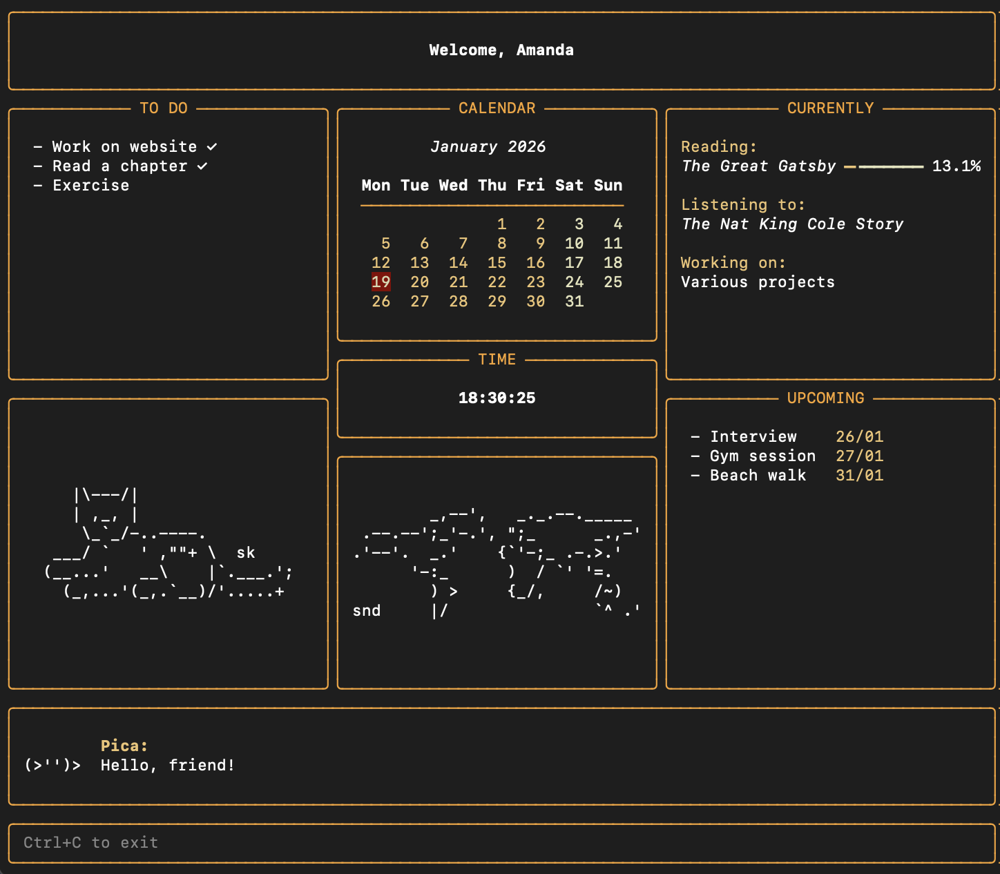

# cli-dashboard

A personal dashboard run from the command line, made using Python and Rich.

### Features
- To do list
- Calendar
- Live clock
- Current activities
- Upcoming events
- ASCII art
- Motivation from Picca

### Requirements
- Python (3.9+)
- [Rich](https://rich.readthedocs.io/en/latest/introduction.html)
- [pipx](https://pipx.pypa.io/stable/installation/)

### Installation
1. Clone the repository and navigate to it
2. Install the dashboard using pipx by running `pipx install --e .`

The dashboard can now be run anywhere in the command line, simply by running the command `dashboard`.

### Editing the dashboard
- Example json files have been provided in the `data` folder and should be copied or renamed to `todo.json`, `currently.json`, and `events.json` before running the dashboard.
- Dashboard data can be updated in `data/todo.json`, `data/currently.json`, and `data/events.json`. Make sure to follow the formatting of the example files.

`Ctrl+C` to close the dashboard.
